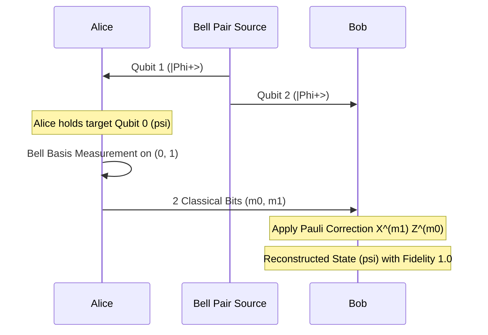

# Quantum Teleportation Protocol Skill

High-efficiency, zero-dependency Python implementation of the **3-Qubit Quantum Teleportation Protocol**.

## Features
- **Bell-State Shared Entanglement**: Distributes shared EPR pair \((|\Phi^+
angle)\) between Alice and Bob.
- **Bell Measurement & Feedforward**: Encodes quantum information into 2 classical bits followed by Pauli \(X^a Z^b\) correction.
- **Zero External Dependencies**: Pure Python standard library (`math`).
- **Native MCP Protocol**: JSON-RPC 2.0 stdio server compatible with Claude Desktop, Cursor, and Windsurf.

## Architecture

